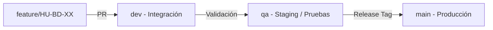

# Configuración del Motor de Base de Datos

## Motor Utilizado
* **Motor:** PostgreSQL 16 (LTS)
* **Dialecto:** ANSI SQL / PL/pgSQL
* **Herramienta de Control de Versiones:** Changelogs basados en YAML (formato Liquibase)

---

## Justificación Técnica y Académica

1. **Integridad Relacional y ACID Estricto:**
   Drivique gestiona operaciones críticas como reservas de vehículos, transacciones monetarias, perfiles de usuarios y trazabilidad de viajes en tiempo real. PostgreSQL asegura cumplimiento ACID completo y manejo confiable de concurrencia mediante MVCC (Multi-Version Concurrency Control).

2. **Soporte Nativo Geoespacial y Tipos Avanzados:**
   Permite el uso de extensiones de hashing y seguridad (`pgcrypto`), identificadores universales (`uuid-ossp`) y escalabilidad futura para geolocalización (PostGIS) requerida en la asignación y rastreo de vehículos.

3. **Operaciones Idempotentes y Upserts:**
   Capacidad nativa para resoluciones `ON CONFLICT DO UPDATE / NOTHING`, facilitando migraciones seguras y sincronización de datos con el Backend.

4. **Compatibilidad con CI/CD y Ecosistema de Migraciones:**
   Permite estructurar scripts DDL/DML/DCL ordenados e integrarse con herramientas de automatización de esquemas como Liquibase.

---

## Estructura General y Convenciones

### 1. Esquemas Lógicos
* `public` / `core`: Tablas maestras, usuarios, autenticación y configuración del sistema.
* `operations`: Módulos de viajes, reservas, vehículos y disponibilidad.
* `billing`: Facturación, pagos, tarifas y transacciones.
* `audit`: Logs de auditoría, eventos y trazabilidad mediante triggers.

### 2. Convenciones de Codificación
* **Idempotencia Obligatoria:** Todas las instrucciones de creación y modificación deben emplear cláusulas seguras (`CREATE TABLE IF NOT EXISTS`, `ADD COLUMN IF NOT EXISTS`, `DROP TABLE IF EXISTS`).
* **Nomenclatura:** Nombres de tablas y columnas en minúsculas con guiones bajos (`snake_case`), nombres de tablas en plural (ej. `users`, `vehicles`, `reservations`).
* **Políticas de Rollback:** Cada cambio estructural o de datos debe contar con su contraparte en el directorio `05_rollbacks/`.

---

## Flujo de Entornos y Despliegue de Esquemas

* **Desarrollo (`dev`):** Integración continua de nuevas características y migraciones.
* **Pruebas (`qa`):** Validación de integridad de datos, ejecución de tests y control de calidad.
* **Producción (`main`):** Esquemas y datos productivos estables y congelados por release.
