# Diagrama entidad relación físico de Drivique

**HU:** HU-DOC-008 · **Responsable:** Danna Valentina Barrios Penagos · **Fecha:** 2026-10-07

## Alcance y fuentes

El ER representa el SQL versionado de `database`, rama `dev`, commit `e2cb3446cd6528dcd9951ef00d5be0d6cab61e94`. Incluye **69 tablas, 565 columnas y 94 claves foráneas**, con las alteraciones posteriores alcanzables desde el maestro Liquibase. No se certifica una instancia desplegada ni se modifican migraciones.

La revisión incorpora `iam.user_social_accounts` respecto a HU-DOC-003. Se actualiza el [diccionario físico](data-dictionary.md) al mismo commit. El maestro alcanza 206 archivos SQL de avance; no se incluyen rollbacks como definiciones adicionales.

Fuente: [maestro Liquibase](https://github.com/project-drivique/database/blob/e2cb3446cd6528dcd9951ef00d5be0d6cab61e94/changelog/db.changelog-master.yaml).

## Vista general

La vista general muestra las 69 entidades con PK, FK y atributos UNIQUE simples. Abra el SVG para ampliar; las vistas por esquema incluyen todos los atributos de sus tablas. El Mermaid editable contiene las 565 columnas del modelo completo.

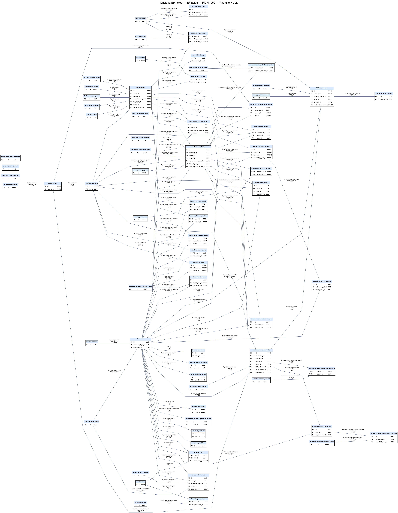

- [SVG ampliable](../../assets/diagrams/er-diagram.svg)
- [PNG para compartir con Emily](../../assets/diagrams/er-diagram.png)
- [Fuente editable Mermaid](../../assets/diagrams/er-diagram.mmd)
- [Fuente editable Graphviz](../../assets/diagrams/er-diagram.dot)
- [Inventario de relaciones con columnas y cardinalidades](er-relationships.csv)

## Lectura de claves y cardinalidades

- Los nombres conservan `esquema.tabla`; en Mermaid se usa `esquema__tabla` para identificar entidades sin ambigüedad.
- **PK** identifica clave primaria, **FK** clave foránea y **UK** una unicidad de columna simple. Las claves y unicidades compuestas se consultan en el diccionario. `?` indica columna que admite NULL.
- Cada línea va de tabla referenciada a tabla que contiene la FK. Su etiqueta indica constraint, columna local y cardinalidad **padres por hijo : hijos por padre**.
- **1 : 0..N** significa que cada hijo necesita un padre y el padre admite cero o muchos hijos. **0..1 : 0..N** corresponde a una FK nullable. **1 : 0..1** corresponde a una FK obligatoria cubierta por una PK/UNIQUE simple o compuesta; el padre puede no tener fila hija.
- En Mermaid se utiliza línea discontinua para la relación de referencia; no expresa `ON DELETE`. Las acciones de borrado y las restricciones adicionales están en el diccionario.
- Las relaciones muchos a muchos se representan mediante sus tablas intermedias, como `iam.role_permissions`, `fleet.vehicle_features` y `rental.reservation_additional_services`.
- No se deducen FK por el nombre de una columna. Por ejemplo, un identificador de recurso de auditoría o una referencia externa no crea por sí solo una relación física.

## Vistas por esquema

Las entidades del esquema usan cabecera azul; los padres de otros esquemas usan gris y solo muestran claves para dar contexto. Cada vista contiene todas las FK salientes del esquema. Las FK entrantes se consultan en su esquema de origen o en la vista general y el CSV.

### audit

3 tablas propias. [SVG ampliable](../../assets/diagrams/er-audit.svg) · [Fuente editable](../../assets/diagrams/er-audit.dot).

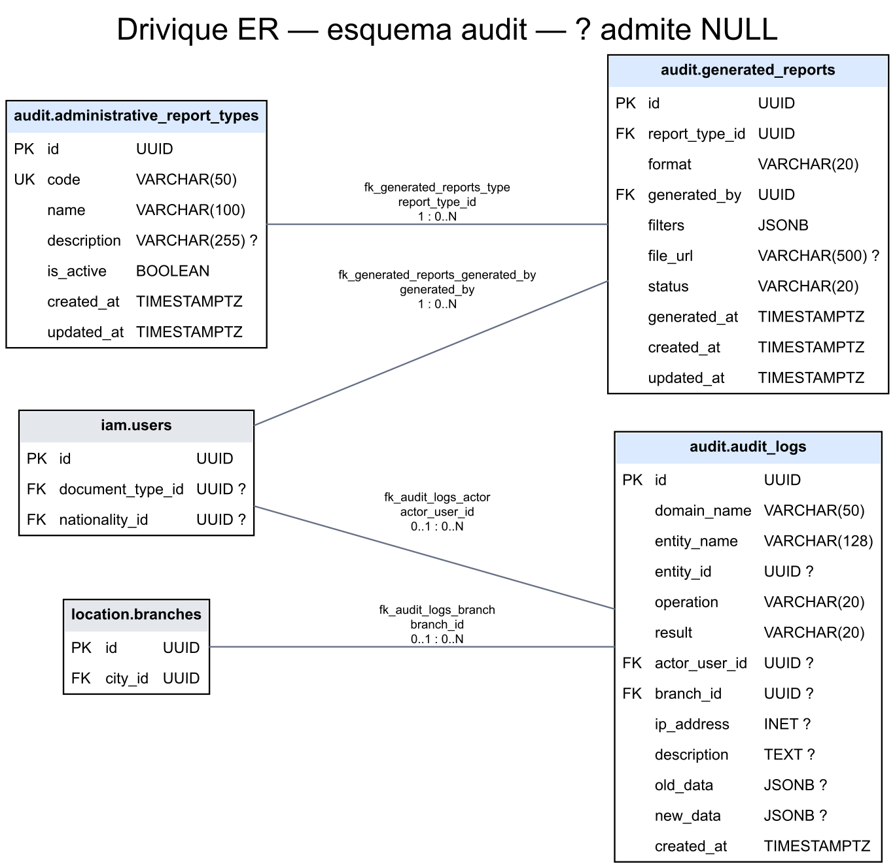

### billing

5 tablas propias. [SVG ampliable](../../assets/diagrams/er-billing.svg) · [Fuente editable](../../assets/diagrams/er-billing.dot).

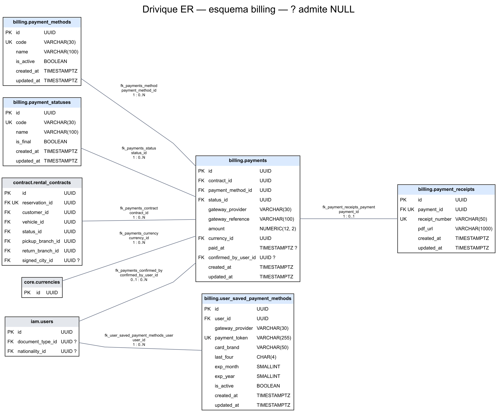

### catalog

5 tablas propias. [SVG ampliable](../../assets/diagrams/er-catalog.svg) · [Fuente editable](../../assets/diagrams/er-catalog.dot).

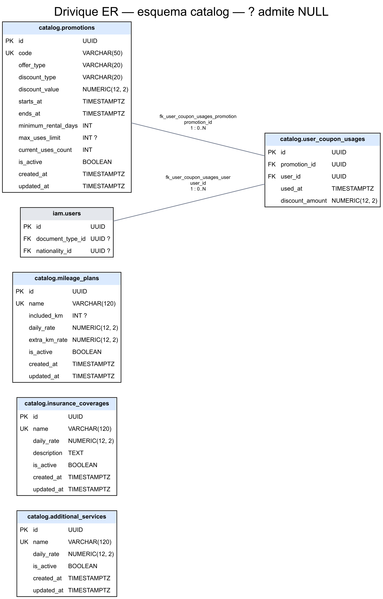

### contract

7 tablas propias. [SVG ampliable](../../assets/diagrams/er-contract.svg) · [Fuente editable](../../assets/diagrams/er-contract.dot).

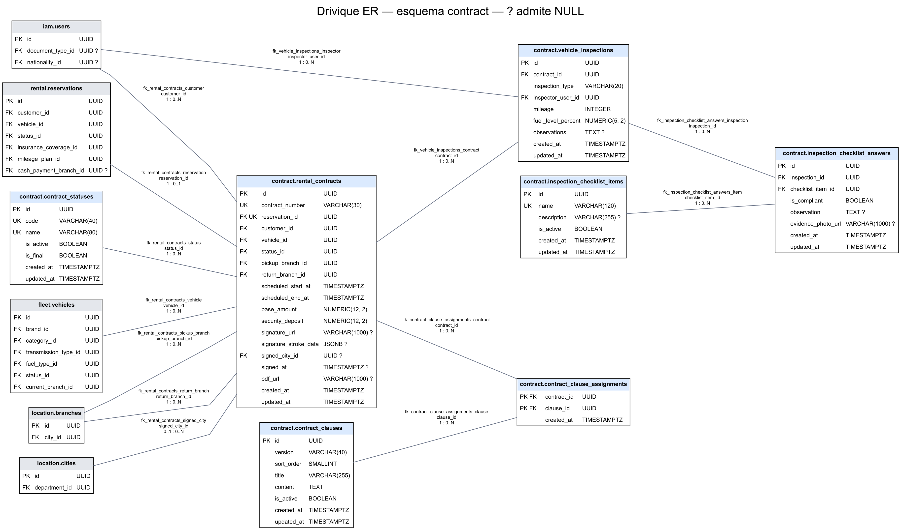

### core

4 tablas propias. [SVG ampliable](../../assets/diagrams/er-core.svg) · [Fuente editable](../../assets/diagrams/er-core.dot).

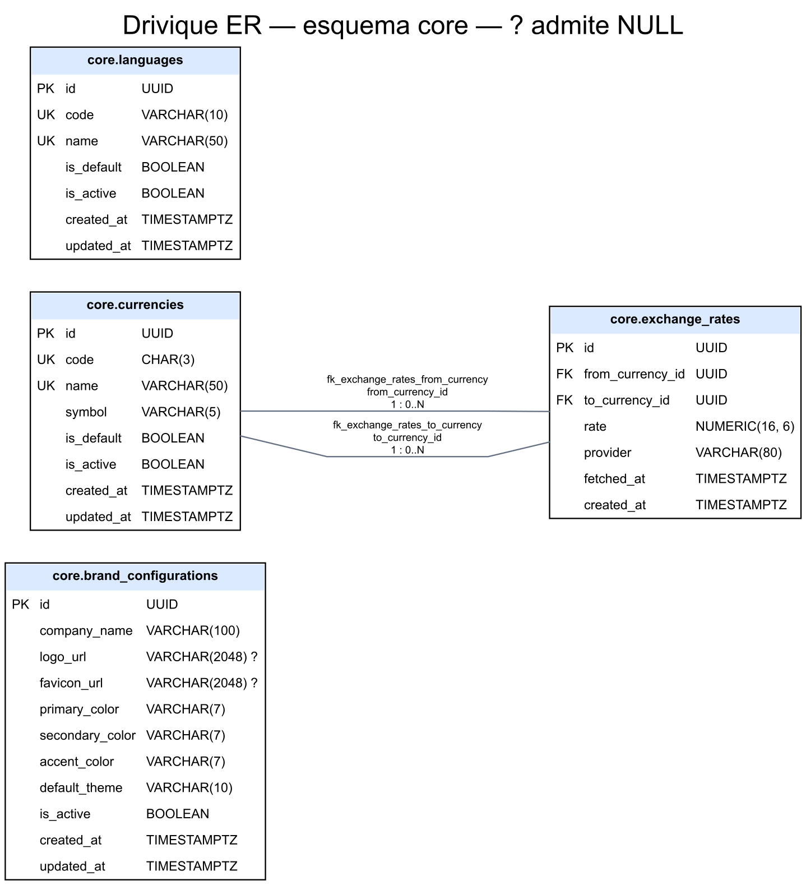

### fleet

13 tablas propias. [SVG ampliable](../../assets/diagrams/er-fleet.svg) · [Fuente editable](../../assets/diagrams/er-fleet.dot).

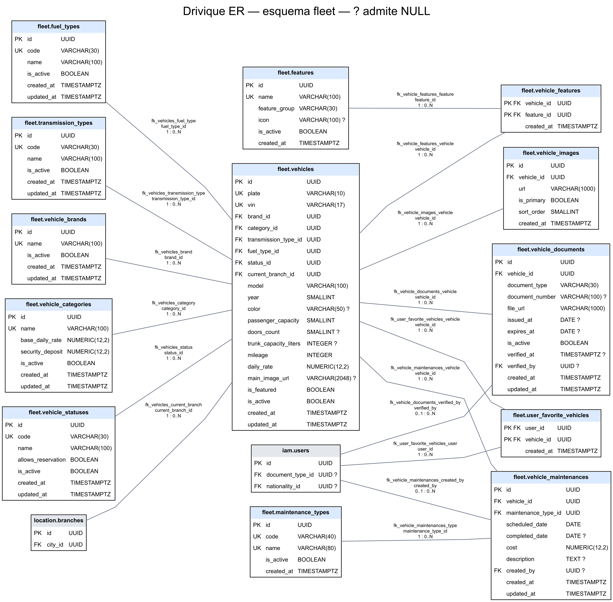

### iam

17 tablas propias. [SVG ampliable](../../assets/diagrams/er-iam.svg) · [Fuente editable](../../assets/diagrams/er-iam.dot).

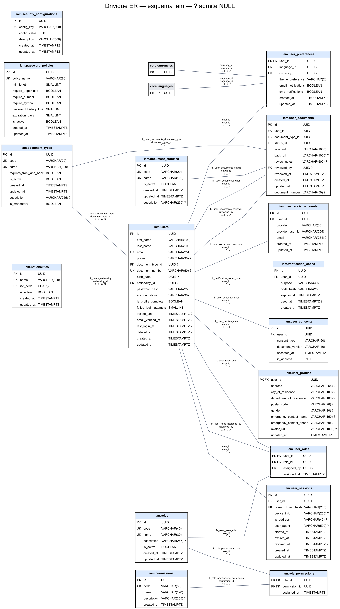

### location

4 tablas propias. [SVG ampliable](../../assets/diagrams/er-location.svg) · [Fuente editable](../../assets/diagrams/er-location.dot).

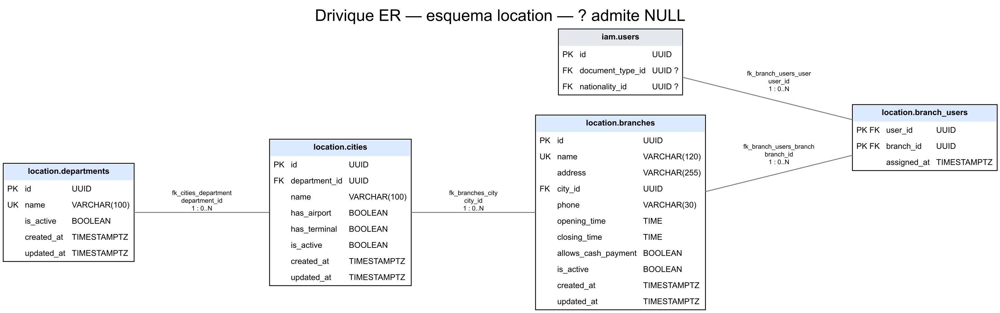

### rental

8 tablas propias. [SVG ampliable](../../assets/diagrams/er-rental.svg) · [Fuente editable](../../assets/diagrams/er-rental.dot).

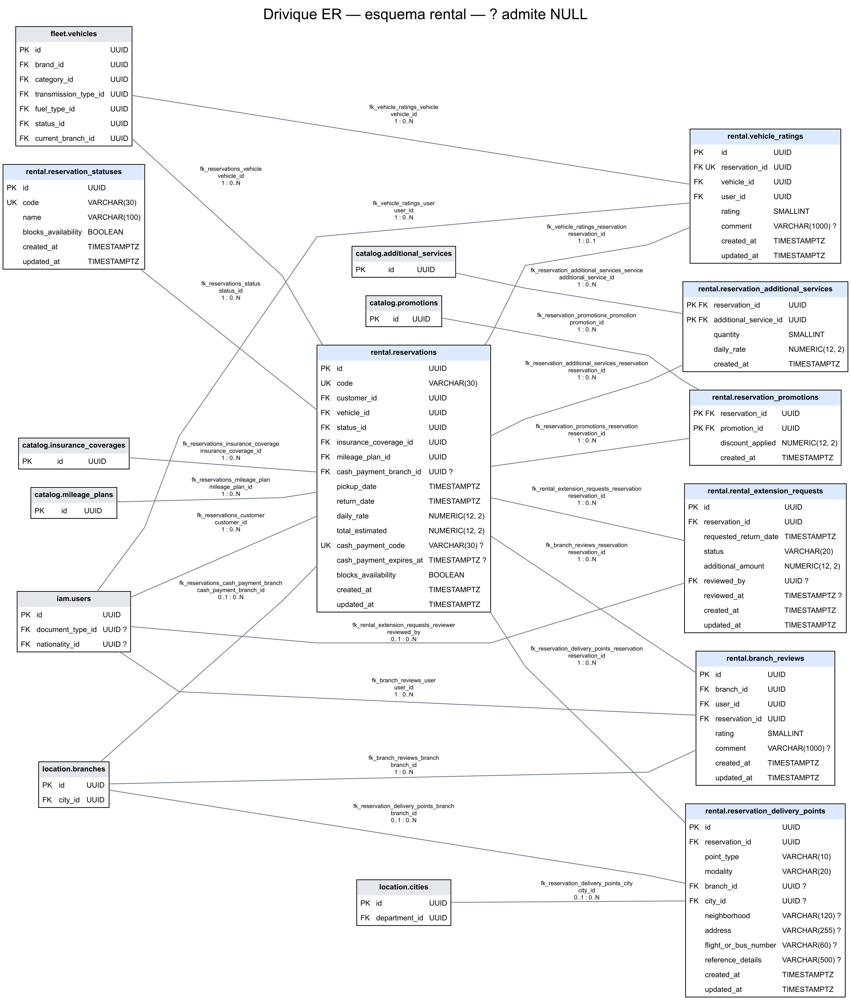

### support

3 tablas propias. [SVG ampliable](../../assets/diagrams/er-support.svg) · [Fuente editable](../../assets/diagrams/er-support.dot).

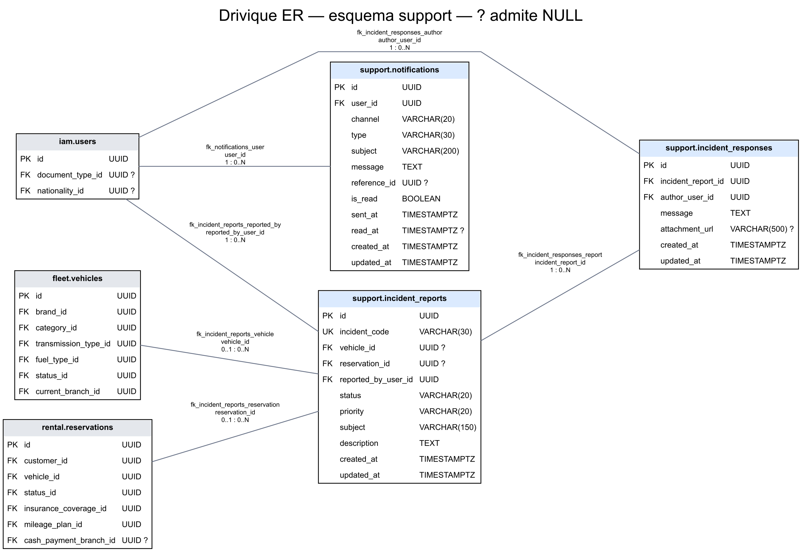

## Límites y brechas de implementación

El ER conserva el modelo existente. No agrega un PIN de entrega, una asignación de conductor ni una respuesta oficial inmutable a reseñas que no estén definidos físicamente. Esas brechas siguen registradas en el diccionario y requieren sus migraciones de implementación.

La carga y aprobación documental antes de crear una reserva es una regla del flujo pendiente de revisión, conforme a la observación de Danna. La relación entre documentos y usuario no demuestra por sí sola que el backend bloquee una reserva sin aprobación. No se modifica esa regla en esta HU de representación del modelo.

## DoR

- [x] Rama `HU-DOC-008-dev` creada desde `dev` por Danna y verificada.
- [x] SQL, maestro Liquibase y diccionario disponibles y comparados.
- [x] Commit de base de datos y alcance físico identificados.

## DoD

- [x] ER cubre todas las entidades y FK del SQL alcanzable por Liquibase.
- [x] PK, FK, nulabilidad y cardinalidades se derivan de restricciones físicas.
- [x] Fuente editable y exportaciones SVG/PNG disponibles, con vistas legibles por esquema.
- [x] Diccionario actualizado con la nueva tabla y el mismo corte de fuentes.
- [x] Inventario de relaciones y referencias locales verificados.
- [ ] Revisión del equipo y observaciones resueltas.
- [ ] Commit, push y PR de cierre según el flujo del equipo.
- [ ] Emily publica las exportaciones acordadas en Drive y agrega el enlace de entrega.

## Checklist de ejecución y cierre

- [x] Revisar las definiciones CREATE TABLE y ALTER TABLE incluidas por Liquibase.
- [x] Incluir referencias inline y constraints de tabla.
- [x] Contrastar cambios frente a HU-DOC-003 y actualizar inventario del diccionario.
- [x] Generar fuentes y exportaciones; comprobar cobertura y abrir las vistas renderizadas.
- [x] Registrar brechas sin inventar tablas o relaciones.
- [ ] Completar revisión, PR y entrega en Drive con Emily.

## Mantenimiento

Al cambiar `database`, repetir extracción del SQL alcanzable por el maestro, revisar ALTER y constraints, actualizar diccionario, ER, CSV y exportaciones, y fijar el nuevo commit. La revisión falla ante SQL no reconocido para impedir una omisión silenciosa. Las fuentes `.dot` pueden editarse y renderizarse con Graphviz; `.mmd` puede abrirse en un visor Mermaid. Conservar fuentes y exportaciones juntas en cada actualización.
