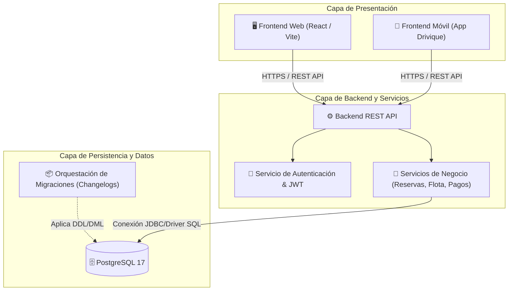

# Visión General de la Arquitectura del Sistema

El ecosistema de **Drivique** está diseñado como una arquitectura cliente-servidor desacoplada y escalable, compuesta por tres capas principales: capa de presentación (Web y Móvil), capa de servicios de aplicación (Backend API) y capa de persistencia (Base de Datos Relacional).

---

## Diagrama de Arquitectura de Alto Nivel

---

## Componentes Principales

### 1. Clientes Frontend (Web y Móvil)
* **Web (React/Vite):** Portal de administración, gestión de flota, reportes y atención a usuarios.
* **Móvil (Drivique App):** Aplicación orientada a conductores y usuarios finales para reservas, navegación y seguimiento en tiempo real.

### 2. Backend REST API
* Expone endpoints seguros (JSON sobre HTTPS) bajo autenticación stateless basada en tokens (JWT).
* Contiene los controladores, validaciones de reglas de negocio y capa de acceso a datos (DAO/ORM/Query Builder).

### 3. Capa de Base de Datos y Persistencia
* **Motor:** PostgreSQL 17 (LTS) garantizando propiedades ACID y alta consistencia de datos.
* **Gestión de Cambios:** Despliegue de esquemas orquestado por Changelogs y versionamiento modular de scripts (`01_ddl`, `02_dml`, `03_dcl`, `04_tcl`).
* **Seguridad y Reversibilidad:** Políticas de mínimo privilegio (DCL), segregación por esquemas y scripts de reversión simétrica (`05_rollbacks`).
