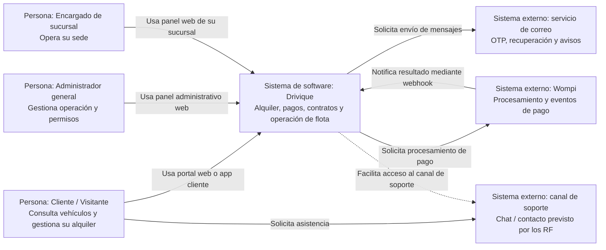
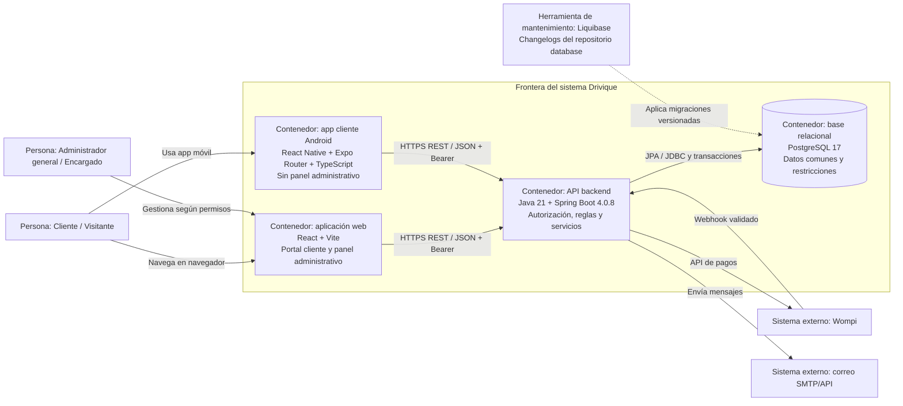

# Arquitectura de Drivique: contexto y contenedores

**Responsable:** Danna Valentina Barrios Penagos · **HU:** HU-DOC-003 · **Fecha:** 2026-10-06

## 1. Alcance y estado de la revisión

Drivique utiliza una web con **portal de clientes y panel administrativo**, una **app móvil exclusiva para clientes**, una API backend común y una base PostgreSQL compartida. El personal administrativo opera en web; no hay un panel administrativo en la app. El conductor de entrega es un participante operativo, no un contenedor ni una aplicación independiente definida por esta arquitectura.

Se documentan dos vistas del modelo C4: **nivel 1 (contexto)**, que muestra personas y sistemas, y **nivel 2 (contenedores)**, que muestra aplicaciones y almacenamiento. Los diagramas se expresan en Mermaid con tipos C4 rotulados; un contenedor representa una unidad de ejecución o almacenamiento, no necesariamente un contenedor Docker.

La arquitectura combina responsabilidades observadas en el código y relaciones previstas para el producto. No acredita despliegue productivo, aprobación de todos los RF o integración probada de cada pantalla. Los contratos e integraciones deben validarse por HU.

## 2. C4 nivel 1: contexto del sistema

```mermaid
flowchart LR
    Cliente["Persona: Cliente / Visitante<br/>Consulta vehículos y gestiona su alquiler"]
    Admin["Persona: Administrador general<br/>Gestiona operación y permisos"]
    Encargado["Persona: Encargado de sucursal<br/>Opera su sede"]
    Drivique["Sistema de software: Drivique<br/>Alquiler, pagos, contratos y operación de flota"]
    Wompi["Sistema externo: Wompi<br/>Procesamiento y eventos de pago"]
    Correo["Sistema externo: servicio de correo<br/>OTP, recuperación y avisos"]
    Soporte["Sistema externo: canal de soporte<br/>Chat / contacto previsto por los RF"]

    Cliente -->|Usa portal web o app cliente| Drivique
    Admin -->|Usa panel administrativo web| Drivique
    Encargado -->|Usa panel web de su sucursal| Drivique
    Drivique -->|Solicita procesamiento de pago| Wompi
    Wompi -->|Notifica resultado mediante webhook| Drivique
    Drivique -->|Solicita envío de mensajes| Correo
    Cliente -->|Solicita asistencia| Soporte
    Drivique -.->|Facilita acceso al canal de soporte| Soporte
```

El rectángulo Drivique representa el sistema completo, no solo la API. Wompi, correo y soporte quedan fuera de su frontera. La configuración efectiva del canal de soporte depende de su HU y de las fuentes RF18/RF33; no se presupone una API propia de WhatsApp.

## 3. C4 nivel 2: contenedores

```mermaid
flowchart LR
    Cliente["Persona: Cliente / Visitante"]
    Personal["Persona: Administrador general / Encargado"]

    subgraph Sistema["Frontera del sistema Drivique"]
        Web["Contenedor: aplicación web<br/>React + Vite<br/>Portal cliente y panel administrativo"]
        Movil["Contenedor: app cliente Android<br/>React Native + Expo Router + TypeScript<br/>Sin panel administrativo"]
        Backend["Contenedor: API backend<br/>Java 21 + Spring Boot 4.0.8<br/>Autorización, reglas y servicios"]
        DB[("Contenedor: base relacional<br/>PostgreSQL 17<br/>Datos comunes y restricciones")]
    end

    Wompi["Sistema externo: Wompi"]
    Correo["Sistema externo: correo SMTP/API"]
    Migracion["Herramienta de mantenimiento: Liquibase<br/>Changelogs del repositorio database"]

    Cliente -->|Navega en navegador| Web
    Cliente -->|Usa app móvil| Movil
    Personal -->|Gestiona según permisos| Web
    Web -->|HTTPS REST / JSON + Bearer| Backend
    Movil -->|HTTPS REST / JSON + Bearer| Backend
    Backend -->|JPA / JDBC y transacciones| DB
    Backend -->|API de pagos| Wompi
    Wompi -->|Webhook validado| Backend
    Backend -->|Envía mensajes| Correo
    Migracion -.->|Aplica migraciones versionadas| DB
```

El portal cliente y el panel son áreas del mismo frontend web, no dos APIs ni dos bases de datos. Web y móvil solo acceden a datos mediante la API. Liquibase participa en evolución del esquema, fuera del recorrido de cada petición; no se representa como un servicio de negocio ni se presume ejecución automática desde Spring Boot.

## 4. Responsabilidades y límites

| Elemento | Responsabilidad | Límite |
| --- | --- | --- |
| Web | Experiencia pública/cliente y operación administrativa por rol. | Ocultar rutas o botones no autoriza solicitudes en servidor. |
| App | Experiencia del cliente y preferencias locales. | Sin módulos administrativos; sin conexión directa a BD. |
| API | Sesión, permisos, reglas de disponibilidad/precio, pagos, contratos y operaciones. | Debe validar datos, ámbito de sede y confirmaciones externas. |
| PostgreSQL | Persistencia, relaciones, constraints e índices del modelo físico. | Un índice o FK no acredita todas las reglas de negocio. |
| Liquibase | Orden y registro de migraciones del repositorio database. | Recuperación y cambios deben validarse por migración. |
| Servicios externos | Pagos, correo y canales de atención. | Fallos/reintentos se manejan sin confirmar cobros o duplicar operaciones. |

## 5. Capas del backend

Dentro del contenedor API se distinguen presentación HTTP (controllers/DTO), aplicación y negocio (services), acceso a datos (repositories/entidades) e infraestructura/persistencia (JDBC/PostgreSQL e integraciones). No son cuatro servidores independientes.

El código revisado contiene controllers, services, repositories, configuración de seguridad y filtro JWT. El [ADR backend](decisions/0003-stack-backend.md) describe una base inicial anterior que aún no tenía JWT ni módulos; se conserva como antecedente y debe actualizarse en su HU para reflejar el avance actual. Esta revisión usa el código más reciente disponible localmente, no ese estado inicial como fotografía vigente.

## 6. Contratos, seguridad y flujos críticos

- La API revisada usa contexto `/api` y controladores versionados. La web configura `VITE_API_URL`; móvil debe usar `EXPO_PUBLIC_API_URL` según integración. Contratos concretos se validan contra controllers/OpenAPI.
- Spring Security incluye configuración stateless, filtro JWT y permisos; comprobar cada operación y ámbito de sucursal requiere pruebas, no solo revisar la configuración.
- Wompi se procesa mediante servicios backend y webhook. El cliente no decide la aprobación de una transacción por su pantalla de regreso.
- El efectivo usa estado y fecha de vencimiento persistidos. La entrega exige documentación/contrato y autorización según RF aplicables.
- **Decisión de producto confirmada por Danna:** el PIN de entrega tiene exactamente **4 dígitos**. No modifica el OTP de correo. RF27/RF52 y SRS ya reflejan este formato; su implementación en contratos API y modelo físico necesita validación en las HU correspondientes.
- Los idiomas definidos son español, inglés, francés, portugués y portugués brasileño. La clave `br` del frontend requiere correspondencia con los catálogos/API; no se añade un sexto idioma.

## 7. Modelo de datos y migraciones

El [diccionario de datos](database/data-dictionary.md) cubre las **68 tablas y 558 columnas** identificadas en los scripts DDL del repositorio database, incluyendo alteraciones, FK, constraints, índices y triggers. Es una descripción del esquema versionado; no un volcado de una instancia desplegada.

El maestro `changelog/db.changelog-master.yaml` referencia migraciones modulares y releases. La revisión comprueba que todos los archivos de tablas/alteraciones documentados están alcanzados por el maestro. No se ejecutan migraciones ni se certifica una base productiva en esta HU.

Hay diferencias entre nombres del plan y modelo real: por ejemplo, `rental.branch_reviews`, `catalog.promotions`, `audit.audit_logs` y datos de efectivo en `rental.reservations`/`billing`. Las brechas de fotos/respuesta oficial, asignación de conductor y PIN se detallan en el diccionario; no se inventan tablas para dar por implementado el plan.

## 8. ADRs relacionados

- [ADR 0001: stack web](decisions/0001-stack-web.md).
- [ADR 0002: stack móvil](decisions/0002-stack-mobile.md).
- [ADR 0003: stack backend](decisions/0003-stack-backend.md), antecedente pendiente de sincronización con el avance.
- [ADR 0004: motor de datos](decisions/0004-motor-base-de-datos.md), fuente de selección de PostgreSQL/Liquibase; sus afirmaciones de garantías deben verificarse por migración y entorno.

## 9. Fuentes y fecha de corte

Clones locales revisados el 2026-10-06. Las versiones declaradas son evidencia de esa rama, no garantía de que todos los ambientes ejecuten el mismo código.

| Repositorio | Rama revisada | Commit |
| --- | --- | --- |
| front-end_web | `HU-INT-04-dev` | `701c61b5cefa1da259fe99d80b7a89bcffdcbdea` |
| front-end_movil | `HU-INT-04-dev` | `3374d4c8a9ca1286f79dfcc63019b9ef3ba5b4b4` |
| Back-end | `HU-INT-04-dev` | `10309795b6af42ef6467e8c409a845a1e3b723bb` |
| database | `HU-INT-04-dev` | `681041da4d882aebf2b157cbc827e0b265af7147` |

- [pom.xml](https://github.com/project-drivique/Back-end/blob/10309795b6af42ef6467e8c409a845a1e3b723bb/pom.xml): Java/Spring Boot y dependencias.
- [src/main/java/com/drivique/api/config/SecurityConfig.java](https://github.com/project-drivique/Back-end/blob/10309795b6af42ef6467e8c409a845a1e3b723bb/src/main/java/com/drivique/api/config/SecurityConfig.java): seguridad revisada.
- [src/main/resources/application.yml](https://github.com/project-drivique/Back-end/blob/10309795b6af42ef6467e8c409a845a1e3b723bb/src/main/resources/application.yml): contexto de API; no se transcriben secretos ni valores de entorno.
- [docker-compose.yml](https://github.com/project-drivique/Back-end/blob/10309795b6af42ef6467e8c409a845a1e3b723bb/docker-compose.yml): imagen PostgreSQL 17 de desarrollo.
- [changelog/db.changelog-master.yaml](https://github.com/project-drivique/database/blob/681041da4d882aebf2b157cbc827e0b265af7147/changelog/db.changelog-master.yaml): maestro de migraciones.
- Fuentes de web/móvil fijadas en sus ADRs; [RF](../01-srs/functional-requirements.md) y [RNF](../01-srs/non-functional-requirements.md) documentan comportamiento esperado.

## 10. DoR, DoD y checklist de HU-DOC-003

### DoR (Definition of Ready)

- [x] Requisitos y plan disponibles para documentar decisiones y alcance.
- [x] Clones web, móvil, backend y database disponibles para revisión de fuentes.
- [x] Rama `HU-DOC-003-dev` y cuatro archivos de entrega identificados.

### DoD (Definition of Done)

- [x] ADR web y móvil documentan contexto, decisión, justificación, alternativas y consecuencias.
- [x] Arquitectura incluye C4 nivel 1 y nivel 2 con personas, fronteras y relaciones.
- [x] Diccionario cubre tablas, columnas, tipos, nulabilidad, claves, restricciones e índices del DDL revisado.
- [x] Versiones y diferencias con el plan identificadas con fuentes verificables.
- [ ] Revisión del equipo completada y observaciones resueltas.
- [ ] Commit y PR de la HU preparados conforme al flujo acordado.

### Checklist de ejecución y cierre

- [x] Contrastar alcance por plataforma y fuentes de tecnología.
- [x] Leer scripts DDL y alteraciones e identificar restricciones y relaciones.
- [x] Redactar los dos ADRs y las vistas C4.
- [x] Sustituir el diccionario de ejemplo por el modelo físico documentado.
- [x] Validar cobertura, referencias y formato de los cuatro documentos; diff revisado antes del commit.
- [ ] Adjuntar evidencia de revisión documental y completar el cierre con el equipo.

Se sincronizaron SRS, RF, resumen y matriz con las decisiones confirmadas: PIN de entrega de 4 dígitos, app exclusiva de cliente, web cliente/administración y cinco variantes de idioma. La numeración coincide entre las 54 fichas y la matriz; la cobertura UML y las brechas de implementación permanecen identificadas.
